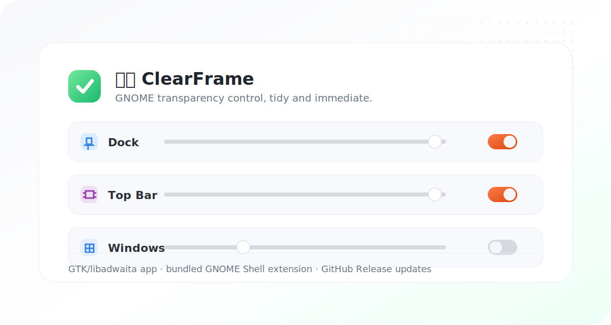

<p align="center">
  
</p>

<h1 align="center">透界 ClearFrame</h1>

<p align="center">
  A quiet GNOME utility for Dock, top bar, and window transparency.
  <br>
  为 GNOME 桌面提供 Dock、顶栏和窗口透明度控制。
</p>

<p align="center">
  <a href="https://github.com/wintopic/ClearFrame/releases/latest"></a>
  <a href="LICENSE"></a>
  
  
</p>

<p align="center">
  
</p>

## Highlights

- Control Dock transparency through Ubuntu Dock / Dash to Dock settings.
- Make the GNOME top bar transparent with the bundled Shell extension.
- Optionally apply whole-window transparency to normal application windows.
- Use a compact GTK/libadwaita interface with language, About, and update controls.
- Check and download GitHub Releases through the system proxy when GNOME proxy settings are enabled.
- Show action dialogs only when user attention is needed, such as when GNOME Shell must recognize the extension after login.

## 安装

```bash
git clone https://github.com/wintopic/ClearFrame.git
cd ClearFrame
./clearframe install
```

安装后可以从应用启动器打开 **透界**，也可以直接运行：

```bash
./clearframe gui
```

首次安装 Shell 扩展后，如果顶栏或窗口透明暂时没有生效，请注销并重新登录一次。

## Commands

```bash
./clearframe gui         # Open the settings window
./clearframe install     # Install or refresh app files and Shell extension
./clearframe on          # Enable Dock and top bar transparency
./clearframe off         # Disable transparency effects
./clearframe status      # Print current transparency state
./clearframe window-on   # Enable whole-window transparency
./clearframe window-off  # Disable whole-window transparency
```

## Updates

The app checks the latest GitHub Release:

https://github.com/wintopic/ClearFrame/releases/latest

Downloads are saved to `~/Downloads`. When a system proxy is configured in GNOME Settings, ClearFrame uses it for update checks and downloads.

## Project Layout

```text
clearframe                 Main Python GTK/libadwaita app and CLI
extension/                 Bundled GNOME Shell extension
extension/schemas/         GSettings schema for transparency options
icons/                     Local SVG icon set used by the app UI
```

## License

MIT
